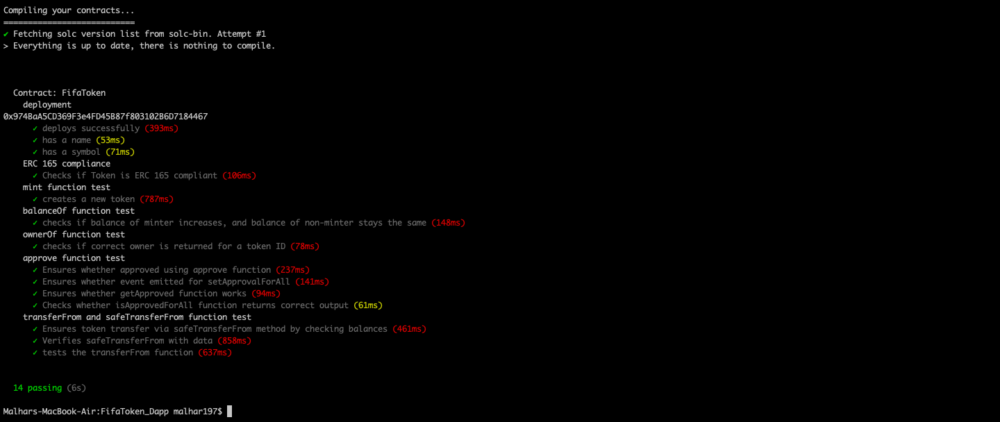

#FIFA Token DApp
##Malhar Dave

This Dapp mints FifaToken, an ERC721-based collectible token that consists of virtual soccer player statistics on the FIFA videogame.

##Smart Contract Class Diagram

##How To Run

1) Clone this repository.

2) npm install in command line to install all prerequisite dependencies

3) Deploy ganache testnet.

4) truffle migrate in command line to migrate contract to the testnet.

6) Connect metamask to ganache testnet

5) Import ganache account into metamask using private key.

6) npm run start in command line to run DApp on port:3000.

##Testing

7) truffle test

 